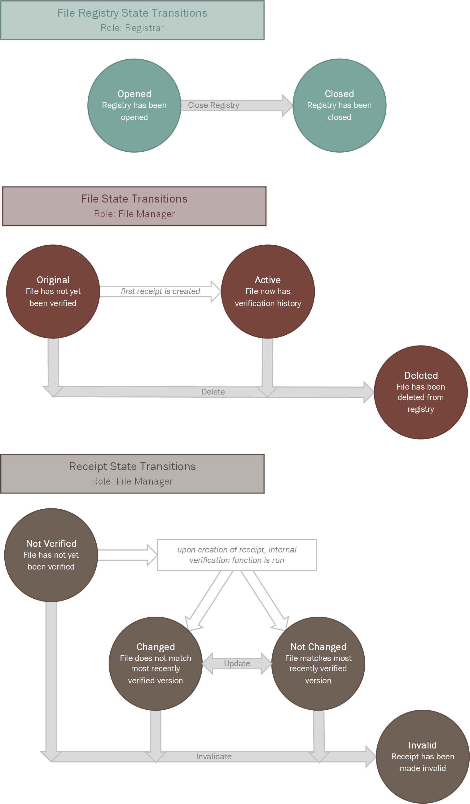
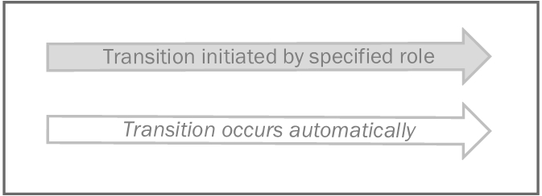

File Verification System for Azure Blockchain Workbench
==============================================

Overview
--------
Ethereum-based file verification system for use through Azure Blockchain Workbench with OneDrive integration

Workflows
---------

**File registries** : contain an array of files, each of which must have a unique file ID

**Files** : store data pertaining to a file that was uploaded to OneDrive, along with an array of receipts for verifications of that file

**Receipts** : store data pertaining to a verification of the parent file at a specific date and time

Workflow Details
----------------

##### Key

